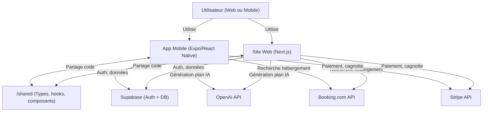
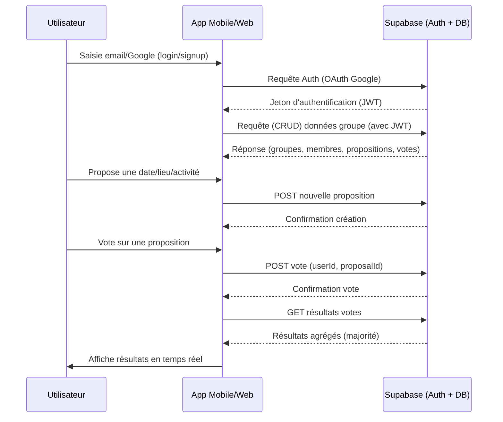

# SocialPlanr – Gestionnaire d'événements collaboratif intelligent

## Sommaire
- [Présentation](#présentation)
- [Architecture du projet](#architecture-du-projet)
- [Prérequis](#prérequis)
- [Initialisation du monorepo](#initialisation-du-monorepo)
- [Installation et lancement du projet mobile (Expo/React Native)](#installation-et-lancement-du-projet-mobile-expo-react-native)
- [Installation et lancement du site web (Next.js)](#installation-et-lancement-du-site-web-nextjs)
- [Déploiement du site sur Netlify](#déploiement-du-site-sur-netlify)
- [Tester l'app mobile sur un Pixel 8 (ou tout Android)](#tester-lapp-mobile-sur-un-pixel-8-ou-tout-android)
- [Structure des dossiers](#structure-des-dossiers)
- [Fonctionnalités MVP](#fonctionnalités-mvp)
- [Roadmap](#roadmap)

---

## Présentation
SocialPlanr est une application permettant à des groupes d'organiser ensemble des événements (week-end, voyage, soirée…) en collaborant sur la date, le lieu, les activités et les dépenses. L'app intègre de la logique de vote, de l'agrégation de données de voyage, et de l'IA générative pour proposer des plans automatiques.

## Architecture du projet
Monorepo avec :
- `/mobile` : Application mobile (Expo/React Native)
- `/web` : Site de présentation (Next.js, React)
- `/shared` : Types, hooks, composants réutilisables

## Prérequis
- Node.js >= 18
- npm >= 9 ou yarn/pnpm
- [Expo CLI](https://docs.expo.dev/get-started/installation/)
- [Git](https://git-scm.com/)
- (Optionnel) [Netlify CLI](https://docs.netlify.com/cli/get-started/)

## Initialisation du monorepo

1. **Cloner le repo ou créer le dossier principal**
   ```bash
   mkdir SocialPlanr && cd SocialPlanr
   git init
   ```

2. **Initialiser le projet mobile (Expo/React Native)**
   ```bash
   npx create-expo-app mobile
   # ou, pour TypeScript :
   npx create-expo-app mobile --template tabs@49.0.0 --npm
   ```

3. **Initialiser le site web (Next.js)**
   ```bash
   npx create-next-app@latest web --typescript
   ```

4. **Créer le dossier partagé**
   ```bash
   mkdir shared
   ```

5. **(Optionnel) Initialiser un gestionnaire de monorepo**
   - Pour une gestion avancée, tu peux utiliser [Turborepo](https://turbo.build/) ou [Nx](https://nx.dev/):
     ```bash
     npm install -g turbo
     npx turbo init
     # puis déplacer mobile/, web/, shared/ dans le monorepo
     ```

## Installation et lancement du projet mobile (Expo/React Native)

1. Aller dans le dossier mobile :
   ```bash
   cd mobile
   npm install
   # ou yarn
   ```

2. Lancer le projet Expo :
   ```bash
   npx expo start
   ```

3. Un QR code s'affiche dans le terminal ou sur la page web Expo.

## Installation et lancement du site web (Next.js)

1. Aller dans le dossier web :
   ```bash
   cd ../web
   npm install
   # ou yarn
   ```

2. Lancer le serveur de développement :
   ```bash
   npm run dev
   ```

3. Le site est accessible sur [http://localhost:3000](http://localhost:3000)

## Déploiement du site sur Netlify

1. Créer un compte sur [Netlify](https://www.netlify.com/)
2. Connecter le repo GitHub à Netlify
3. Sélectionner le dossier `web` comme dossier de build
4. Build command :
   ```bash
   npm run build
   ```
5. Publish directory :
   ```
   web/.next
   ```
6. Netlify détecte Next.js automatiquement et déploie le site

## Tester l'app mobile sur un Pixel 8 (ou tout Android)

1. Installer l'app **Expo Go** depuis le Play Store sur ton Pixel 8
2. Lancer le projet Expo (`npx expo start` dans `/mobile`)
3. Scanner le QR code affiché avec l'app Expo Go
4. L'app se lance instantanément sur ton téléphone

## Structure des dossiers

```
/SocialPlanr
  /mobile      ← App mobile Expo (React Native)
  /web         ← Site Next.js (React)
  /shared      ← Types, hooks, composants communs
  README.md
```

## Fonctionnalités MVP
- Authentification Google (Supabase Auth)
- Création et gestion de groupes (admin/membres)
- Propositions et votes (dates, lieux, activités)
- Génération IA d’un plan de voyage (OpenAI API)
- Gestion des dépenses et cagnotte (Stripe)
- Intégration d’un fournisseur externe (ex: Booking.com)

## Roadmap
1. Initialiser le monorepo et les projets mobile/web
2. Authentification et gestion de groupes
3. Propositions et votes collaboratifs
4. Génération IA de plans
5. Gestion des dépenses et paiement
6. Intégration Booking.com
7. Déploiement web sur Netlify
8. Tests sur mobile (Pixel 8)

---

**Pour toute question ou bug, ouvre une issue ou contacte l’équipe !**

## Schéma d'architecture



### Explications des composants et interactions

- **Utilisateur (Web ou Mobile)** : accède à l'application via le site web ou l'app mobile.
- **App Mobile (Expo/React Native)** : application mobile complète, toutes fonctionnalités collaboratives.
- **Site Web (Next.js)** : site de présentation, mais peut aussi proposer des fonctionnalités collaboratives (MVP ou plus tard).
- **/shared** : dossier pour partager des types TypeScript, hooks, composants UI entre le web et le mobile (évite la duplication de logique).
- **Supabase (Auth + DB)** : gère l'authentification (Google, etc.) et stocke toutes les données (groupes, votes, dépenses, etc.).
- **OpenAI API** : génère automatiquement des plans d'événements personnalisés selon les préférences du groupe.
- **Booking.com API** : permet de suggérer des hébergements en lien avec le plan généré.
- **Stripe API** : gère la cagnotte et les paiements entre membres du groupe.

**Flux principaux :**
- L'utilisateur interagit avec l'app mobile ou le site web.
- Les deux apps partagent du code via `/shared`.
- Les apps communiquent avec Supabase pour l'auth et la gestion des données.
- Pour la génération de plans, elles appellent l'API OpenAI.
- Pour l'hébergement, elles appellent Booking.com.
- Pour la gestion des paiements, elles utilisent Stripe.

## Schéma technique : Auth, Data & Vote



### Explications du flux
- **Authentification** : L'utilisateur se connecte via Google, l'app envoie la requête à Supabase qui retourne un JWT.
- **Accès aux données** : L'app utilise le JWT pour requêter les données du groupe (sécurisé).
- **Proposition** : L'utilisateur propose une date/lieu/activité, l'app envoie la création à Supabase.
- **Vote** : L'utilisateur vote, l'app envoie le vote à Supabase.
- **Résultats** : L'app récupère les résultats agrégés et les affiche en temps réel.