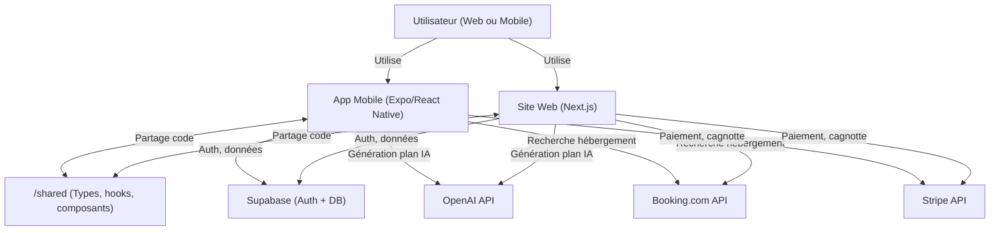
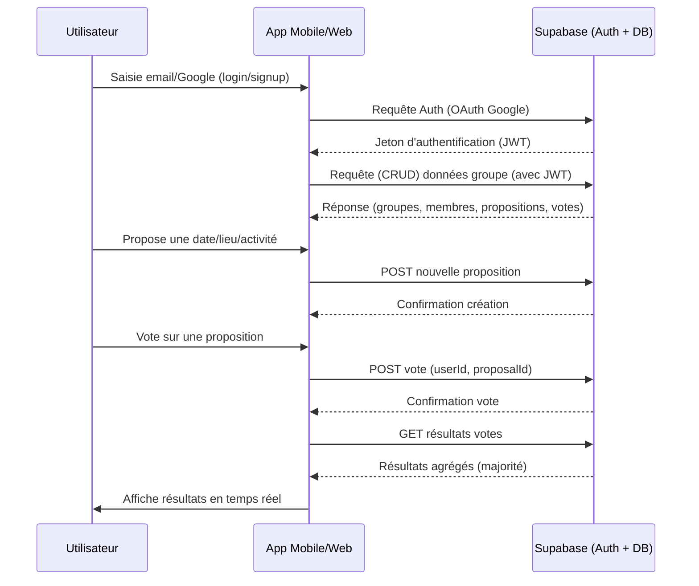

# SocialPlanr – Gestionnaire d'événements collaboratif intelligent

[](https://github.com/alfredgibeauahoussinou/SocialPlanr-Gestionnaire-d-v-nements-collaboratif-intelligent/actions)
[](./LEGAL_DOCUMENTS_ENHANCED.md)
[](https://expo.dev/)
[](https://nextjs.org/)
[](#)
[](https://prettier.io/)
[](#)

---

## 🚀 Résumé rapide
SocialPlanr est une plateforme collaborative intelligente pour organiser des événements de groupe (voyages, week-ends, soirées, etc.) avec gestion des votes, des dépenses, et génération automatique de plans grâce à l’IA. L’app centralise tout : choix de dates, lieux, activités, gestion de la cagnotte, et suggestions d’hébergement. Accessible sur mobile (Expo/React Native) et web (Next.js).

---

## 🖼️ Aperçu visuel

> **À insérer :**
> - Capture d’écran de l’accueil mobile
> - Capture d’écran du dashboard web
> - Capture d’écran de la gestion des dépenses

---

## 🛠️ Technologies principales

| Technologie      | Usage principal                |
|------------------|-------------------------------|
| Expo/React Native| Application mobile            |
| Next.js/React    | Site web                      |
| Supabase         | Authentification & base de données |
| OpenAI API       | Génération IA de plans         |
| Stripe           | Paiement & cagnotte           |
| Booking.com API  | Suggestions d’hébergement      |
| TypeScript       | Typage & robustesse           |
| Turborepo/Nx     | Gestion du monorepo (optionnel)|

---

## ✨ Fonctionnalités clés
- 🔐 Authentification Google (Supabase)
- 👥 Gestion de groupes (admin/membres)
- 🗳️ Propositions & votes collaboratifs (dates, lieux, activités)
- 🤖 Génération IA de plans personnalisés (OpenAI)
- 💸 Gestion des dépenses & cagnotte (Stripe)
- 🏨 Suggestions d’hébergement (Booking.com)
- 📱 App mobile (Expo/React Native) & site web (Next.js)
- 🔄 Partage de code via `/shared` (types, hooks, composants)

---

## 🔄 Exemple de flux utilisateur

1. **Inscription/Connexion** via Google
2. **Création d’un groupe** ou rejoindre un groupe existant
3. **Proposition de dates, lieux, activités**
4. **Vote collaboratif** sur les propositions
5. **Génération automatique d’un plan** (IA)
6. **Gestion des dépenses** et suivi de la cagnotte
7. **Suggestions d’hébergement**
8. **Notifications** pour les actions importantes

---

## 📦 Exemple de structure de données (TypeScript)

```ts
// Exemple de type pour un événement
export type Event = {
  id: string;
  name: string;
  groupId: string;
  date: string;
  location: string;
  activities: string[];
  expenses: Expense[];
  proposals: Proposal[];
};

export type Expense = {
  id: string;
  payerId: string;
  amount: number;
  description: string;
  participants: string[];
};

export type Proposal = {
  id: string;
  type: 'date' | 'location' | 'activity';
  value: string;
  votes: { userId: string; value: boolean }[];
};
```

---

## Sommaire
- [Présentation](#présentation)
- [Architecture du projet](#architecture-du-projet)
- [Prérequis](#prérequis)
- [Initialisation du monorepo](#initialisation-du-monorepo)
- [Installation et lancement du projet mobile (Expo/React Native)](#installation-et-lancement-du-projet-mobile-expo-react-native)
- [Installation et lancement du site web (Next.js)](#installation-et-lancement-du-site-web-nextjs)
- [Déploiement du site sur Netlify](#déploiement-du-site-sur-netlify)
- [Tester l'app mobile sur un Pixel 8 (ou tout Android)](#tester-lapp-mobile-sur-un-pixel-8-ou-tout-android)
- [Structure des dossiers](#structure-des-dossiers)
- [Fonctionnalités MVP](#fonctionnalités-mvp)
- [Roadmap](#roadmap)
- [Guides & Documentation](#guides--documentation)
- [FAQ](#faq)
- [Sécurité & Confidentialité](#sécurité--confidentialité)
- [Contribuer](#contribuer)
- [Support & Contact](#support--contact)
- [Licence](#licence)
- [Crédits & Remerciements](#crédits--remerciements)

---

## Présentation
SocialPlanr est une application permettant à des groupes d'organiser ensemble des événements (week-end, voyage, soirée…) en collaborant sur la date, le lieu, les activités et les dépenses. L'app intègre de la logique de vote, de l'agrégation de données de voyage, et de l'IA générative pour proposer des plans automatiques.

## Architecture du projet
Monorepo avec :
- `/mobile` : Application mobile (Expo/React Native)
- `/web` : Site de présentation (Next.js, React)
- `/shared` : Types, hooks, composants réutilisables

## Prérequis
- Node.js >= 18
- npm >= 9 ou yarn/pnpm
- [Expo CLI](https://docs.expo.dev/get-started/installation/)
- [Git](https://git-scm.com/)
- (Optionnel) [Netlify CLI](https://docs.netlify.com/cli/get-started/)

## Initialisation du monorepo

1. **Cloner le repo ou créer le dossier principal**
   ```bash
   mkdir SocialPlanr && cd SocialPlanr
   git init
   ```

2. **Initialiser le projet mobile (Expo/React Native)**
   ```bash
   npx create-expo-app mobile
   # ou, pour TypeScript :
   npx create-expo-app mobile --template tabs@49.0.0 --npm
   ```

3. **Initialiser le site web (Next.js)**
   ```bash
   npx create-next-app@latest web --typescript
   ```

4. **Créer le dossier partagé**
   ```bash
   mkdir shared
   ```

5. **(Optionnel) Initialiser un gestionnaire de monorepo**
   - Pour une gestion avancée, tu peux utiliser [Turborepo](https://turbo.build/) ou [Nx](https://nx.dev/):
     ```bash
     npm install -g turbo
     npx turbo init
     # puis déplacer mobile/, web/, shared/ dans le monorepo
     ```

## Installation et lancement du projet mobile (Expo/React Native)

1. Aller dans le dossier mobile :
   ```bash
   cd mobile
   npm install
   # ou yarn
   ```

2. Lancer le projet Expo :
   ```bash
   npx expo start
   ```

3. Un QR code s'affiche dans le terminal ou sur la page web Expo.

## Installation et lancement du site web (Next.js)

1. Aller dans le dossier web :
   ```bash
   cd ../web
   npm install
   # ou yarn
   ```

2. Lancer le serveur de développement :
   ```bash
   npm run dev
   ```

3. Le site est accessible sur [http://localhost:3000](http://localhost:3000)

## Déploiement du site sur Netlify

1. Créer un compte sur [Netlify](https://www.netlify.com/)
2. Connecter le repo GitHub à Netlify
3. Sélectionner le dossier `web` comme dossier de build
4. Build command :
   ```bash
   npm run build
   ```
5. Publish directory :
   ```
   web/.next
   ```
6. Netlify détecte Next.js automatiquement et déploie le site

## Tester l'app mobile sur un Pixel 8 (ou tout Android)

### Option 1: Expo Go (Développement)
1. Installer l'app **Expo Go** depuis le Play Store sur ton Pixel 8
2. Lancer le projet Expo (`npx expo start` dans `/mobile`)
3. Scanner le QR code affiché avec l'app Expo Go
4. L'app se lance instantanément sur ton téléphone

### Option 2: APK Installable
1. Générer l'APK avec le script automatisé :
   ```bash
   ./scripts/build-apk.sh
   ```
2. Télécharger l'APK depuis le site : `http://localhost:3000/install`
3. Installer directement sur l'appareil Android
4. L'app fonctionne indépendamment d'Expo Go

## Structure des dossiers

```
/SocialPlanr
  /mobile      ← App mobile Expo (React Native)
  /web         ← Site Next.js (React)
  /shared      ← Types, hooks, composants communs
  README.md
```

## Fonctionnalités MVP
- Authentification Google (Supabase Auth)
- Création et gestion de groupes (admin/membres)
- Propositions et votes (dates, lieux, activités)
- Génération IA d’un plan de voyage (OpenAI API)
- Gestion des dépenses et cagnotte (Stripe)
- Intégration d’un fournisseur externe (ex: Booking.com)

## Génération de l'APK Android

### Génération Automatique
Le script `./scripts/build-apk.sh` automatise complètement le processus :

```bash
# Depuis la racine du projet
./scripts/build-apk.sh
```

Ce script :
- ✅ Installe EAS CLI si nécessaire
- ✅ Configure le projet pour EAS Build
- ✅ Génère l'APK avec signature de développement
- ✅ Copie l'APK vers `/web/public/` pour téléchargement
- ✅ Affiche la taille et l'emplacement du fichier

### Génération Manuelle
Si tu préfères le faire manuellement :

```bash
# Installation d'EAS CLI
npm install -g eas-cli

# Dans le dossier mobile
cd mobile

# Configuration (première fois)
eas build:configure

# Génération APK local
eas build --platform android --local --profile development

# L'APK sera dans le dossier mobile/
```

### Types de Build
- **Development** : APK avec dev client pour tests
- **Preview** : APK optimisé pour distribution interne
- **Production** : AAB pour Google Play Store

## Roadmap
1. ✅ Initialiser le monorepo et les projets mobile/web
2. ✅ Interface utilisateur complète (4 écrans)
3. ✅ Génération APK pour distribution
4. 🔧 Authentification et gestion de groupes (Supabase)
5. 🔧 Propositions et votes collaboratifs temps réel
6. 🔧 Génération IA de plans (OpenAI API)
7. 🔧 Gestion des dépenses et paiement (Stripe)
8. 🔧 Intégration Booking.com
9. 🚀 Déploiement web sur Netlify
10. 🚀 Publication Google Play Store

---

## 📚 Guides & Documentation
- [CALENDAR_INTEGRATION_SUMMARY.md](./CALENDAR_INTEGRATION_SUMMARY.md)
- [CLEAN_APP_GUIDE.md](./CLEAN_APP_GUIDE.md)
- [DASHBOARD_GUIDE.md](./DASHBOARD_GUIDE.md)
- [EXPENSE_SYSTEM_GUIDE.md](./EXPENSE_SYSTEM_GUIDE.md)
- [EXPO_GO_GOOGLE_SIGNIN_GUIDE.md](./EXPO_GO_GOOGLE_SIGNIN_GUIDE.md)
- [EXPO_TYPESCRIPT_SOLUTION.md](./EXPO_TYPESCRIPT_SOLUTION.md)
- [FIREBASE_GUIDE.md](./FIREBASE_GUIDE.md)
- [FIREBASE_SETUP_GUIDE.md](./FIREBASE_SETUP_GUIDE.md)
- [GOOGLE_AUTH_GUIDE.md](./GOOGLE_AUTH_GUIDE.md)
- [GOOGLE_CALENDAR_INTEGRATION_GUIDE.md](./GOOGLE_CALENDAR_INTEGRATION_GUIDE.md)
- [INSTALL_APK.md](./INSTALL_APK.md)
- [LEGAL_DOCUMENTS_ENHANCED.md](./LEGAL_DOCUMENTS_ENHANCED.md)
- [MODAL_DATE_TIME_UPGRADE.md](./MODAL_DATE_TIME_UPGRADE.md)
- [MODAL_TEST_GUIDE.md](./MODAL_TEST_GUIDE.md)
- [NEXT_STEPS_GOOGLE_OAUTH.md](./NEXT_STEPS_GOOGLE_OAUTH.md)
- [NOTIFICATION_SYSTEM_GUIDE.md](./NOTIFICATION_SYSTEM_GUIDE.md)
- [ONBOARDING_ULTRA_STYLE_GUIDE.md](./ONBOARDING_ULTRA_STYLE_GUIDE.md)
- [PROFILE_PAGES_ADDED.md](./PROFILE_PAGES_ADDED.md)
- [PROBLEMES_RESOLUS.md](./PROBLEMES_RESOLUS.md)
- [STATUS.md](./STATUS.md)

---

## ❓ FAQ

**Q : L’application est-elle gratuite ?**
> Oui, SocialPlanr est open-source et gratuit pour un usage personnel.

**Q : Puis-je utiliser SocialPlanr pour des événements professionnels ?**
> Oui, mais certaines intégrations (paiement, hébergement) peuvent nécessiter des comptes tiers.

**Q : Où sont stockées mes données ?**
> Les données sont hébergées sur Supabase (Europe), sécurisées et non revendues.

**Q : Comment signaler un bug ou demander une fonctionnalité ?**
> Ouvre une issue sur GitHub ou contacte l’équipe.

---

## 🔒 Sécurité & Confidentialité
- Authentification sécurisée via OAuth (Google)
- Données chiffrées côté serveur (Supabase)
- Respect du RGPD : aucune revente de données, suppression sur demande
- Paiements gérés par Stripe (certifié PCI DSS)
- Les clés API sensibles sont stockées dans des variables d’environnement

---

## 🤝 Contribuer
Les contributions sont les bienvenues !
1. Fork le repo
2. Crée une branche (`git checkout -b feature/ma-feature`)
3. Commit tes changements (`git commit -am 'feat: nouvelle fonctionnalité'`)
4. Push la branche (`git push origin feature/ma-feature`)
5. Ouvre une Pull Request

Merci de consulter le code de conduite et les guides de contribution si disponibles.

---

## 📬 Support & Contact
Pour toute question, bug ou suggestion :
- Ouvre une issue sur GitHub
- Ou contacte l’équipe via le repo

---

## 📄 Licence

Ce projet est sous licence MIT. Voir [LEGAL_DOCUMENTS_ENHANCED.md](./LEGAL_DOCUMENTS_ENHANCED.md) pour plus de détails.

---

## 🙏 Crédits & Remerciements
- [Expo](https://expo.dev/), [React Native](https://reactnative.dev/), [Next.js](https://nextjs.org/), [Supabase](https://supabase.com/), [Stripe](https://stripe.com/), [OpenAI](https://openai.com/), [Booking.com](https://www.booking.com/)
- Merci à tous les contributeurs et testeurs !

---

## Schéma d'architecture



### Explications des composants et interactions

- **Utilisateur (Web ou Mobile)** : accède à l'application via le site web ou l'app mobile.
- **App Mobile (Expo/React Native)** : application mobile complète, toutes fonctionnalités collaboratives.
- **Site Web (Next.js)** : site de présentation, mais peut aussi proposer des fonctionnalités collaboratives (MVP ou plus tard).
- **/shared** : dossier pour partager des types TypeScript, hooks, composants UI entre le web et le mobile (évite la duplication de logique).
- **Supabase (Auth + DB)** : gère l'authentification (Google, etc.) et stocke toutes les données (groupes, votes, dépenses, etc.).
- **OpenAI API** : génère automatiquement des plans d'événements personnalisés selon les préférences du groupe.
- **Booking.com API** : permet de suggérer des hébergements en lien avec le plan généré.
- **Stripe API** : gère la cagnotte et les paiements entre membres du groupe.

**Flux principaux :**
- L'utilisateur interagit avec l'app mobile ou le site web.
- Les deux apps partagent du code via `/shared`.
- Les apps communiquent avec Supabase pour l'auth et la gestion des données.
- Pour la génération de plans, elles appellent l'API OpenAI.
- Pour l'hébergement, elles appellent Booking.com.
- Pour la gestion des paiements, elles utilisent Stripe.

## Schéma technique : Auth, Data & Vote



### Explications du flux
- **Authentification** : L'utilisateur se connecte via Google, l'app envoie la requête à Supabase qui retourne un JWT.
- **Accès aux données** : L'app utilise le JWT pour requêter les données du groupe (sécurisé).
- **Proposition** : L'utilisateur propose une date/lieu/activité, l'app envoie la création à Supabase.
- **Vote** : L'utilisateur vote, l'app envoie le vote à Supabase.
- **Résultats** : L'app récupère les résultats agrégés et les affiche en temps réel.