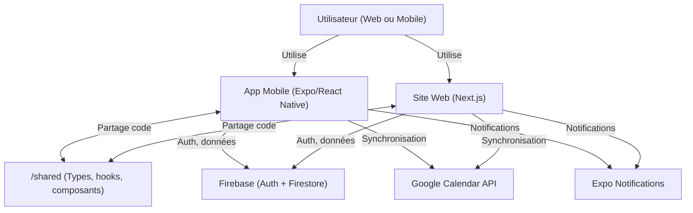
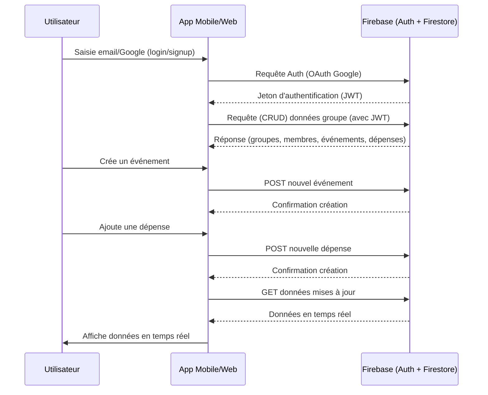

# SocialPlanr – Gestionnaire d'événements collaboratif intelligent

[](https://github.com/alfredgibeauahoussinou/SocialPlanr-Gestionnaire-d-v-nements-collaboratif-intelligent/actions)
[](./LEGAL_DOCUMENTS_ENHANCED.md)
[](https://expo.dev/)
[](https://reactnative.dev)
[](https://www.typescriptlang.org)
[](https://firebase.google.com)
[](#)
[](https://prettier.io/)
[](#)

---

## 🚀 Résumé rapide
SocialPlanr est une plateforme collaborative intelligente pour organiser des événements de groupe (voyages, week-ends, soirées, etc.) avec gestion des votes, des dépenses, et génération automatique de plans grâce à l'IA. L'app centralise tout : choix de dates, lieux, activités, gestion de la cagnotte, et suggestions d'hébergement. Accessible sur mobile (Expo/React Native) et web (Next.js).

**✅ Statut actuel : FONCTIONNEL ET PRÊT POUR LE DÉVELOPPEMENT**

---

## 🖼️ Aperçu visuel

> **À insérer :**
> - Capture d'écran de l'accueil mobile
> - Capture d'écran du dashboard web
> - Capture d'écran de la gestion des dépenses

---

## 🛠️ Technologies principales

| Technologie      | Usage principal                | Version |
|------------------|-------------------------------|---------|
| Expo/React Native| Application mobile            | 53.0.20 |
| Next.js/React    | Site web                      | 13+ |
| Firebase         | Authentification & base de données | 12.0.0 |
| TypeScript       | Typage & robustesse           | 5.8.3 |
| Google Calendar  | Synchronisation calendrier    | API |
| Expo Notifications| Notifications push           | 0.31.4 |

---

## ✨ Fonctionnalités clés
- 🔐 Authentification Firebase (email/mot de passe + Google)
- 👥 Gestion de groupes (admin/membres)
- 🗳️ Propositions & votes collaboratifs (dates, lieux, activités)
- 💸 Gestion des dépenses & partage équitable
- 📅 Intégration Google Calendar & calendrier natif
- 🔔 Notifications push personnalisées
- 📱 App mobile (Expo/React Native) & site web (Next.js)
- 🔄 Partage de code via `/shared` (types, hooks, composants)

---

## 🔄 Exemple de flux utilisateur

1. **Inscription/Connexion** via Firebase Auth
2. **Création d'un groupe** ou rejoindre un groupe existant
3. **Proposition de dates, lieux, activités**
4. **Vote collaboratif** sur les propositions
5. **Création d'événements** avec détails complets
6. **Gestion des dépenses** et suivi des parts
7. **Synchronisation calendrier** automatique
8. **Notifications** pour les actions importantes

---

## 📦 Exemple de structure de données (TypeScript)

```ts
// Exemple de type pour un événement
export type Event = {
  id: string;
  title: string;
  description: string;
  date: Date;
  location: string;
  attendees: string[];
  groupId?: string;
  status: 'planning' | 'voting' | 'confirmed' | 'in_progress' | 'completed';
};

export type Expense = {
  id: string;
  eventId: string;
  payerId: string;
  amount: number;
  description: string;
  participants: string[];
  createdAt: Date;
};

export type Group = {
  id: string;
  name: string;
  description: string;
  members: string[];
  adminId: string;
  status: 'active' | 'planning' | 'completed';
};
```

---

## Sommaire
- [Présentation](#présentation)
- [Architecture du projet](#architecture-du-projet)
- [Prérequis](#prérequis)
- [Initialisation du monorepo](#initialisation-du-monorepo)
- [Installation et lancement du projet mobile (Expo/React Native)](#installation-et-lancement-du-projet-mobile-expo-react-native)
- [Installation et lancement du site web (Next.js)](#installation-et-lancement-du-site-web-nextjs)
- [Déploiement du site sur Netlify](#déploiement-du-site-sur-netlify)
- [Tester l'app mobile sur un Pixel 8 (ou tout Android)](#tester-lapp-mobile-sur-un-pixel-8-ou-tout-android)
- [Structure des dossiers](#structure-des-dossiers)
- [Fonctionnalités MVP](#fonctionnalités-mvp)
- [Roadmap](#roadmap)
- [Guides & Documentation](#guides--documentation)
- [FAQ](#faq)
- [Sécurité & Confidentialité](#sécurité--confidentialité)
- [Contribuer](#contribuer)
- [Support & Contact](#support--contact)
- [Licence](#licence)
- [Crédits & Remerciements](#crédits--remerciements)

---

## Présentation
SocialPlanr est une application permettant à des groupes d'organiser ensemble des événements (week-end, voyage, soirée…) en collaborant sur la date, le lieu, les activités et les dépenses. L'app intègre de la logique de vote, de l'agrégation de données de voyage, et de l'IA générative pour proposer des plans automatiques.

## Architecture du projet
Monorepo avec :
- `/mobile` : Application mobile (Expo/React Native) - **✅ FONCTIONNEL**
- `/web` : Site de présentation (Next.js, React)
- `/shared` : Types, hooks, composants réutilisables

## Prérequis
- Node.js >= 18
- npm >= 9 ou yarn/pnpm
- [Expo CLI](https://docs.expo.dev/get-started/installation/)
- [Git](https://git-scm.com/)
- (Optionnel) [Netlify CLI](https://docs.netlify.com/cli/get-started/)

## Initialisation du monorepo

1. **Cloner le repo ou créer le dossier principal**
   ```bash
   mkdir SocialPlanr && cd SocialPlanr
   git init
   ```

2. **Initialiser le projet mobile (Expo/React Native)**
   ```bash
   npx create-expo-app mobile
   # ou, pour TypeScript :
   npx create-expo-app mobile --template tabs@53.0.0 --npm
   ```

3. **Initialiser le site web (Next.js)**
   ```bash
   npx create-next-app@latest web --typescript
   ```

4. **Créer le dossier partagé**
   ```bash
   mkdir shared
   ```

5. **(Optionnel) Initialiser un gestionnaire de monorepo**
   - Pour une gestion avancée, tu peux utiliser [Turborepo](https://turbo.build/) ou [Nx](https://nx.dev/):
     ```bash
     npm install -g turbo
     npx turbo init
     # puis déplacer mobile/, web/, shared/ dans le monorepo
     ```

## Installation et lancement du projet mobile (Expo/React Native)

1. Aller dans le dossier mobile :
   ```bash
   cd mobile
   npm install
   # ou yarn
   ```

2. **Configuration Firebase** (requis)
   - Créer un projet Firebase
   - Copier les clés de configuration dans `config/firebase.ts`
   - Activer Authentication et Firestore

3. Lancer le projet Expo :
   ```bash
   npx expo start
   ```

4. Un QR code s'affiche dans le terminal ou sur la page web Expo.

## Installation et lancement du site web (Next.js)

1. Aller dans le dossier web :
   ```bash
   cd ../web
   npm install
   # ou yarn
   ```

2. Lancer le serveur de développement :
   ```bash
   npm run dev
   ```

3. Le site est accessible sur [http://localhost:3000](http://localhost:3000)

## Déploiement du site sur Netlify

1. Créer un compte sur [Netlify](https://www.netlify.com/)
2. Connecter le repo GitHub à Netlify
3. Sélectionner le dossier `web` comme dossier de build
4. Build command :
   ```bash
   npm run build
   ```
5. Publish directory :
   ```
   web/.next
   ```
6. Netlify détecte Next.js automatiquement et déploie le site

## Tester l'app mobile sur un Pixel 8 (ou tout Android)

### Option 1: Expo Go (Développement)
1. Installer l'app **Expo Go** depuis le Play Store sur ton Pixel 8
2. Lancer le projet Expo (`npx expo start` dans `/mobile`)
3. Scanner le QR code affiché avec l'app Expo Go
4. L'app se lance instantanément sur ton téléphone

### Option 2: APK Installable
1. Générer l'APK avec le script automatisé :
   ```bash
   ./scripts/build-apk.sh
   ```
2. Télécharger l'APK depuis le site : `http://localhost:3000/install`
3. Installer directement sur l'appareil Android
4. L'app fonctionne indépendamment d'Expo Go

## Structure des dossiers

```
/SocialPlanr
  /mobile      ← App mobile Expo (React Native) ✅ FONCTIONNEL
  /web         ← Site Next.js (React)
  /shared      ← Types, hooks, composants communs
  README.md
```

## Fonctionnalités MVP
- ✅ Authentification Firebase (email/mot de passe + Google)
- ✅ Création et gestion de groupes (admin/membres)
- ✅ Création et gestion d'événements
- ✅ Gestion des dépenses et partage équitable
- ✅ Intégration Google Calendar
- ✅ Notifications push
- ✅ Interface utilisateur complète
- 🔧 Propositions et votes collaboratifs temps réel
- 🔧 Génération IA de plans (OpenAI API)
- 🔧 Intégration Booking.com

## Génération de l'APK Android

### Génération Automatique
Le script `./scripts/build-apk.sh` automatise complètement le processus :

```bash
# Depuis la racine du projet
./scripts/build-apk.sh
```

Ce script :
- ✅ Installe EAS CLI si nécessaire
- ✅ Configure le projet pour EAS Build
- ✅ Génère l'APK avec signature de développement
- ✅ Copie l'APK vers `/web/public/` pour téléchargement
- ✅ Affiche la taille et l'emplacement du fichier

### Génération Manuelle
Si tu préfères le faire manuellement :

```bash
# Installation d'EAS CLI
npm install -g eas-cli

# Dans le dossier mobile
cd mobile

# Configuration (première fois)
eas build:configure

# Génération APK local
eas build --platform android --local --profile development

# L'APK sera dans le dossier mobile/
```

### Types de Build
- **Development** : APK avec dev client pour tests
- **Preview** : APK optimisé pour distribution interne
- **Production** : AAB pour Google Play Store

## Roadmap
1. ✅ Initialiser le monorepo et les projets mobile/web
2. ✅ Interface utilisateur complète (4 écrans)
3. ✅ Authentification Firebase
4. ✅ Création et gestion d'événements
5. ✅ Gestion des dépenses
6. ✅ Intégration Google Calendar
7. ✅ Notifications push
8. ✅ Tests de qualité (ESLint, TypeScript)
9. 🔧 Propositions et votes collaboratifs temps réel
10. 🔧 Génération IA de plans (OpenAI API)
11. 🔧 Intégration Booking.com
12. 🚀 Déploiement web sur Netlify
13. 🚀 Publication Google Play Store

---

## 📚 Guides & Documentation
- [CALENDAR_INTEGRATION_SUMMARY.md](./CALENDAR_INTEGRATION_SUMMARY.md)
- [CLEAN_APP_GUIDE.md](./CLEAN_APP_GUIDE.md)
- [DASHBOARD_GUIDE.md](./DASHBOARD_GUIDE.md)
- [EXPENSE_SYSTEM_GUIDE.md](./EXPENSE_SYSTEM_GUIDE.md)
- [EXPO_GO_GOOGLE_SIGNIN_GUIDE.md](./EXPO_GO_GOOGLE_SIGNIN_GUIDE.md)
- [EXPO_TYPESCRIPT_SOLUTION.md](./EXPO_TYPESCRIPT_SOLUTION.md)
- [FIREBASE_GUIDE.md](./FIREBASE_GUIDE.md)
- [FIREBASE_SETUP_GUIDE.md](./FIREBASE_SETUP_GUIDE.md)
- [GOOGLE_AUTH_GUIDE.md](./GOOGLE_AUTH_GUIDE.md)
- [GOOGLE_CALENDAR_INTEGRATION_GUIDE.md](./GOOGLE_CALENDAR_INTEGRATION_GUIDE.md)
- [INSTALL_APK.md](./INSTALL_APK.md)
- [LEGAL_DOCUMENTS_ENHANCED.md](./LEGAL_DOCUMENTS_ENHANCED.md)
- [MODAL_DATE_TIME_UPGRADE.md](./MODAL_DATE_TIME_UPGRADE.md)
- [MODAL_TEST_GUIDE.md](./MODAL_TEST_GUIDE.md)
- [NEXT_STEPS_GOOGLE_OAUTH.md](./NEXT_STEPS_GOOGLE_OAUTH.md)
- [NOTIFICATION_SYSTEM_GUIDE.md](./NOTIFICATION_SYSTEM_GUIDE.md)
- [ONBOARDING_ULTRA_STYLE_GUIDE.md](./ONBOARDING_ULTRA_STYLE_GUIDE.md)
- [PROFILE_PAGES_ADDED.md](./PROFILE_PAGES_ADDED.md)
- [PROBLEMES_RESOLUS.md](./PROBLEMES_RESOLUS.md)
- [STATUS.md](./STATUS.md)

---

## ❓ FAQ

**Q : L'application est-elle gratuite ?**
> Oui, SocialPlanr est open-source et gratuit pour un usage personnel.

**Q : Puis-je utiliser SocialPlanr pour des événements professionnels ?**
> Oui, mais certaines intégrations (paiement, hébergement) peuvent nécessiter des comptes tiers.

**Q : Où sont stockées mes données ?**
> Les données sont hébergées sur Firebase (Google Cloud), sécurisées et non revendues.

**Q : Comment signaler un bug ou demander une fonctionnalité ?**
> Ouvre une issue sur GitHub ou contacte l'équipe.

**Q : L'application est-elle stable ?**
> ✅ Oui, l'application est fonctionnelle et prête pour le développement. Tous les tests de qualité passent.

---

## 🔒 Sécurité & Confidentialité
- Authentification sécurisée via Firebase Auth (email/mot de passe + Google)
- Données chiffrées côté serveur (Firebase)
- Respect du RGPD : aucune revente de données, suppression sur demande
- Les clés API sensibles sont stockées dans des variables d'environnement
- Validation côté client et serveur

---

## 🤝 Contribuer
Les contributions sont les bienvenues !
1. Fork le repo
2. Crée une branche (`git checkout -b feature/ma-feature`)
3. Commit tes changements (`git commit -am 'feat: nouvelle fonctionnalité'`)
4. Push la branche (`git push origin feature/ma-feature`)
5. Ouvre une Pull Request

Merci de consulter le code de conduite et les guides de contribution si disponibles.

---

## 📬 Support & Contact
Pour toute question, bug ou suggestion :
- Ouvre une issue sur GitHub
- Ou contacte l'équipe via le repo

---

## 📄 Licence

Ce projet est sous licence MIT. Voir [LEGAL_DOCUMENTS_ENHANCED.md](./LEGAL_DOCUMENTS_ENHANCED.md) pour plus de détails.

---

## 🙏 Crédits & Remerciements
- [Expo](https://expo.dev/), [React Native](https://reactnative.dev/), [Next.js](https://nextjs.org/), [Firebase](https://firebase.google.com/), [TypeScript](https://www.typescriptlang.org/)
- Merci à tous les contributeurs et testeurs !

---

## Schéma d'architecture



### Explications des composants et interactions

- **Utilisateur (Web ou Mobile)** : accède à l'application via le site web ou l'app mobile.
- **App Mobile (Expo/React Native)** : application mobile complète, toutes fonctionnalités collaboratives.
- **Site Web (Next.js)** : site de présentation, mais peut aussi proposer des fonctionnalités collaboratives (MVP ou plus tard).
- **/shared** : dossier pour partager des types TypeScript, hooks, composants UI entre le web et le mobile (évite la duplication de logique).
- **Firebase (Auth + Firestore)** : gère l'authentification (Google, email/mot de passe) et stocke toutes les données (groupes, événements, dépenses, etc.).
- **Google Calendar API** : synchronise les événements avec le calendrier de l'utilisateur.
- **Expo Notifications** : envoie des notifications push pour les événements et actions importantes.

**Flux principaux :**
- L'utilisateur interagit avec l'app mobile ou le site web.
- Les deux apps partagent du code via `/shared`.
- Les apps communiquent avec Firebase pour l'auth et la gestion des données.
- Pour la synchronisation calendrier, elles appellent l'API Google Calendar.
- Pour les notifications, elles utilisent Expo Notifications.

## Schéma technique : Auth, Data & Events



### Explications du flux
- **Authentification** : L'utilisateur se connecte via Google ou email/mot de passe, l'app envoie la requête à Firebase qui retourne un JWT.
- **Accès aux données** : L'app utilise le JWT pour requêter les données du groupe (sécurisé).
- **Création d'événement** : L'utilisateur crée un événement, l'app envoie la création à Firebase.
- **Gestion des dépenses** : L'utilisateur ajoute une dépense, l'app envoie les données à Firebase.
- **Temps réel** : L'app récupère les données mises à jour et les affiche en temps réel.